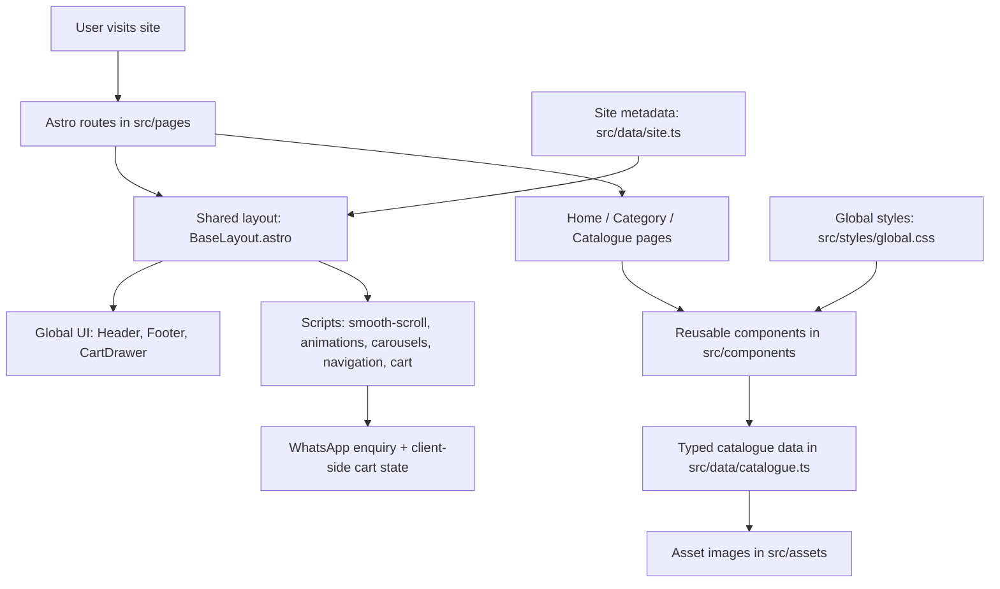

# Varasiddhi Shopping Mall — Project Brain

## 1) What this project is

This is a premium, mobile-first catalogue website for a fashion retail mall in Adilabad.

Core stack:
- Astro 7
- TypeScript
- Tailwind CSS v4
- Lucide icons
- Lenis + Motion
- static output for Cloudflare Pages

The project is not a full e-commerce app yet. It behaves like a curated storefront/catalogue with WhatsApp enquiry flow and planned future online ordering.

Important guardrails from the project instructions:
- no fake pricing, hours, reviews, or policies
- prefer local typed data over a CMS during design
- no checkout/payment architecture unless asked
- use editorial premium design, not template UI
- keep animation subtle and non-blocking

---

## 2) Big-picture architecture

---

## 3) Route map

Routes live under `src/pages` and mirror the navigation model.

Primary pages:
- `src/pages/index.astro` — homepage / storefront landing page
- `src/pages/catalogue.astro` — main catalogue overview
- `src/pages/men.astro` — menswear section
- `src/pages/women.astro` — womenswear section
- `src/pages/sarees.astro` — saree category
- `src/pages/occasion.astro` — occasion/wedding section
- `src/pages/visit.astro` — store visit/contact page
- `src/pages/products/[id].astro` — product detail route pattern

Shared shell:
- `src/layouts/BaseLayout.astro` — head metadata, scripts, global drawer + topbar

---

## 4) Data model: the project brain

The product/content source of truth is `src/data/catalogue.ts`.

That file defines:
- `CatalogueItem`
- `CatalogueGroup`
- `CatalogueCategory`
- product metadata like `id`, `title`, `group`, `category`, `image`, `alt`, `crop`

Everything else usually reads from this dataset:
- home hero slides
- product rails
- category pages
- cart data
- product detail pages

This means if you are adding or changing a product, start here before editing page components.

Related config:
- `src/data/site.ts` — site name, WhatsApp number, announcement, payment messaging

---

## 5) Component map

### Global / layout components
- `src/components/global/Header.astro` — main nav, logo, cart, WhatsApp CTA, mobile drawer
- `src/components/global/Footer.astro` — footer links and brand closing block
- `src/components/global/ProductRail.astro` — reusable horizontal catalogue rail
- `src/components/global/CartDrawer.astro` — enquiry bag drawer
- `src/components/global/ProductCard.astro` — product cards used in rails

### Homepage components
- `src/components/home/EditorialHero.astro`
- `src/components/home/CollectionIndex.astro`
- `src/components/home/StoryBubbles.astro`
- `src/components/home/CategoryWindow.astro`
- `src/components/home/WomenEdit.astro`
- `src/components/home/MenEdit.astro`
- `src/components/home/SareeEdit.astro`
- `src/components/home/OccasionVisit.astro`

### Catalogue components
- `src/components/catalogue/CatalogueHero.astro`
- `src/components/catalogue/CatalogueChapter.astro`
- `src/components/catalogue/CatalogueShelf.astro`
- `src/components/catalogue/CatalogueLook.astro`
- `src/components/catalogue/CategoryDial.astro`
- `src/components/catalogue/CategoryNav.astro`
- `src/components/catalogue/EditorialBreak.astro`
- `src/components/catalogue/VisitCta.astro`

### Shell / loading / motion
- `src/components/SplashScreen.astro` — initial brand splash overlay

---

## 6) Scripts and client behavior

The script layer is intentionally small and modular.

Files in `src/scripts`:
- `smooth-scroll.ts` — Lenis smooth scroll setup
- `animations.ts` — motion / reveal behavior
- `carousels.ts` — horizontal rails and hero carousel interactions
- `navigation.ts` — mobile nav and menu state
- `cart.ts` — enquiry bag logic, quantity updates, WhatsApp message building

Most business logic that feels “interactive” sits here rather than directly in pages.

---

## 7) Styling system

Main style entry:
- `src/styles/global.css`

This is the design token and visual foundation:
- font families
- palette
- spacing / grid scales
- button styles
- hero/product card patterns
- common utility conventions

The project uses custom design language rather than a generic UI kit.

---

## 8) Product flow mental model

The core user flow is:
1. Browse category or homepage
2. View product cards or shelves
3. Add item to enquiry bag
4. Open cart drawer
5. Continue browsing / confirm WhatsApp enquiry

Important implication:
- the cart is not a checkout system
- it is an enquiry workflow leading to WhatsApp
- store team confirmation is still the real order step

---

## 9) Where to edit common tasks

### Add a new product
- update `src/data/catalogue.ts`
- add the asset under `src/assets/catalogue/...`
- ensure `id` matches references used in listings/pages

### Add a new category page
- create a new page in `src/pages`
- reuse `ProductRail` and category filters from `catalogue.ts`

### Change nav or store messaging
- edit `src/components/global/Header.astro`
- edit `src/data/site.ts`

### Change homepage content structure
- edit `src/pages/index.astro`
- or update home component modules inside `src/components/home`

### Change product card or rails styling
- edit `src/components/global/ProductCard.astro`
- edit `src/components/global/ProductRail.astro`

### Change animation behavior
- inspect `src/scripts/animations.ts`
- inspect `src/scripts/smooth-scroll.ts`
- check `prefers-reduced-motion` handling

### Change cart / WhatsApp logic
- edit `src/scripts/cart.ts`
- verify `site.whatsappNumber` in `src/data/site.ts`

---

## 10) North star rules for future work

Keep these in mind while making edits:
- do not invent fake store details
- prefer local typed data
- avoid full e-commerce architecture unless explicitly requested
- keep motion subtle and premium editorial
- use Astro-first, minimal client JS
- do not overwrite source assets
- future pages should align with the product catalogue/data model

---

## 11) Fast start checklist for new tasks

Before coding, check these files in order:
1. `src/data/catalogue.ts`
2. `src/pages/<target>.astro`
3. relevant component in `src/components`
4. relevant script in `src/scripts`
5. `src/styles/global.css` only if visual token changes are needed

This is the shortest path to understand the system without reading every file.

---

## 12) Minimal “mental model” summary

Think of the app as:
- catalogue data layer
- route layer
- reusable editorial component layer
- cart/enquiry interaction layer
- global visual system layer

If a change is content-related, start in `catalogue.ts`.
If a change is layout-related, start in page + component files.
If a change is interaction-related, start in the scripts folder.
If a change is visual design, start in `global.css` and the relevant component.
